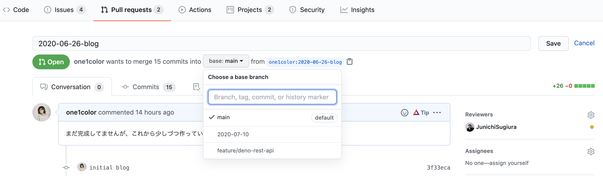

## この発表至るまでの経緯
今月11日にGoogle ChromeのdeveloperであるUna Kravetさんが@githubをメンションに含んで従来のデフォルトのブランチ名を"master"から"main"に変えてもいいよとの趣旨のツイートを投稿しました。

https://twitter.com/Una/status/1271180494944829441

理由としては、

* 😄文字数が少なくなる
* 😄masterより覚えやすい
* 😄黒人の一人でもtechコミュニティーから阻害されていると感じる人がいるならやるべき

といったことが挙げられています。

翌日12日にGitHubのCEOであるNatさんがこのtweetに賛同し、これからGitHub全社を上げて”master”ブランチをよりニュートラルな表現に変更することを発表しました。

https://twitter.com/natfriedman/status/1271253144442253312

そこで候補として"main"というワードが上がりました。

## 実際に変更してみた

そんなにブランチ名を変更すること自体に難しいステップではありませんが、サクッとデフォルトブランチの変更方法をお伝えしていきたいと思います。

それでは一緒に変更していきましょう。順序はこのようになります。

* ローカルでmain branchを作成してcheckout
* ローカルのmain branchをremoteにpush
* 既存のPull Request全てのbase branchをmainに変更
* GitHubの設定からdefault branchをmainに変更
* remoteから"master" branchを削除

詳しくみていきましょう。

#### ローカルでmain branchを作成してcheckout
以下のコマンドで、新しくmainというブランチを作成し、そこにcheckoutすることができます。一応"git brach"コマンドで確認することもできます。
```console
git checkout -b main
git branch
```
#### ローカルのmain branchをremoteにpush
次にローカルのリポジトリを先ほど作ったremoteリポジトリにpushしていきます。
```console
git push origin main
```
#### 既存のPull Request全てのbase branchをmainに変更
Pull Requestがすでにある場合は、それに飛んでマージされるはずのブランチをmainに変更しておきましょう。


#### GitHubの設定からdefault branchをmainに変更
今後もmainをデフォルトのブランチとして使用していくために、githubのサイトの設定から該当のリポジトリのデフォルトブランチを変更していきます。
`@jun 写真欲しい！！`

#### remoteから"master" branchを削除
最後にもうこれから使用しなくなる従来のmasterブランチを削除しましょう。まずはローカルでmasterブランチを削除してそれをリモートにも反映していきます。
```console
git branch -d master
git push -d origin master
```
## そもそもなぜデフォルトのブランチ名に"master"が使われるのか
  