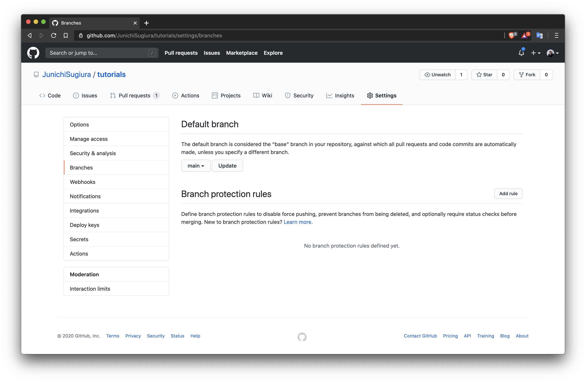

## この発表至るまでの経緯

今月 11 日に Google Chrome の developer である Una Kravet さんが@github をタグに含んで従来のデフォルトのブランチ名を"master"から"main"に変えてもいいよとの趣旨のツイートを投稿しました。

<blockquote class="twitter-tweet"><p lang="en" dir="ltr">For what it’s worth, I’m *super* happy to rename the default branch structure of “master” to “main” and I hope we can all do this together as a community with <a href="https://twitter.com/github?ref_src=twsrc%5Etfw">@github</a> leading the charge by implementing in their product moving forward 🙂</p>&mdash; Una Kravets 👩🏻‍💻 (@Una) <a href="https://twitter.com/Una/status/1271180494944829441?ref_src=twsrc%5Etfw">June 11, 2020</a></blockquote> <script async src="https://platform.twitter.com/widgets.js" charset="utf-8"></script>

理由としては、

- 文字数が少なくなる
- master より覚えやすい
- 黒人の一人でも tech コミュニティーから阻害されていると感じる人がいるならやるべき

といったことが挙げられています。

翌日12日に GitHub の CEO である Nat さんがこの tweet に賛同し、これから GitHub 全社を上げて”master”ブランチをよりニュートラルな表現に変更することを発表しました。

https://twitter.com/natfriedman/status/1271253144442253312

そこで候補として上がったワードが"main"です。そこで実際にgithubのデフォルトブランチをmainに移して見たいと思います！

## 実際に変更してみた

まず、順序はこのようになります。

- ローカルで main branch を作成して checkout
- ローカルの main branch を remote に push
- 既存の Pull Request 全ての base branch を main に変更
- GitHub の設定から default branch を main に変更
- remote から"master" branch を削除

詳しくみていきましょう。

### ローカルで main branch を作成して checkout

以下のコマンドで、新しく main というブランチを作成し、そこに checkout することができます。一応"git brach"コマンドで確認することもできます。

```console
git checkout -b main
git branch
```

### ローカルの main branch を remote に push

次にローカルのリポジトリを先ほど作った remote リポジトリに push していきます。

```console
git push origin main
```

### 既存の Pull Request 全ての base branch を main に変更

Pull Request がすでにある場合は、それに飛んでマージされるはずのブランチを main に変更しておきましょう。


### GitHub の設定から default branch を main に変更

今後も main をデフォルトのブランチとして使用していくために、github のサイトの設定から該当のリポジトリのデフォルトブランチを変更していきます。


### remote から"master" branch を削除

最後にもうこれから使用しなくなる従来の master ブランチを削除しましょう。まずはローカルで master ブランチを削除してそれをリモートにも反映していきます。

```console
git branch -d master
git push -d origin master
```

## そもそもなぜデフォルトのブランチ名に"master"が使われるのか
tech業界では歴史的に"master/slave"という概念を使うことが多くあります。こちらの[Wikipedia](https://en.wikipedia.org/wiki/Master/slave_(technology))を参照してください。

これはtech業界に限った話ではなく音楽業界や映像業界でもこれらの言葉が一般的に使われてきました。

例えば僕もYouTubeの動画編集をしている時に最終的にプラットフォームにアップロードするファイルを書き出すことを"マスタリング"と言ったりします。

### 業界用語への疑問視

先日George Floyedさんという黒人男性が、白人警官に執拗に拘束されて、死亡するという事件が発生したことから"Black Lives Matter"や"Blackout Tuesday"などのムーブメントが加熱しています。そうした流れの中で、人種差別に関連する業界用語への疑問視をする声がたくさん上がってきました。

例えばGoogle Chromeの元となるchromiumというプロジェクトの規約には男女差別や人種差別に関連するワードをソースコードやドキュメントから排除するように促す[ルール](https://chromium.googlesource.com/chromium/src/+/master/styleguide/inclusive_code.md#racially-neutral)が存在しています。

例えば、英語では一般的に"his/her"等のgender表現を使うことがよくありますが、今の世の中ではそれらの言葉に当てはまらないケースも認知されてきてますよね。自分以外の人達を表現するワードとして、"everyone", "folks", "people"などの表現を使うよう定められています。

また"blacklist", "whitelist"などもblackは悪者、whiteは正義と捉えられることから、"blocklist", "allowlist"と表現するよう決められています。

実際にchromiumのソースコードで"blacklist"と[検索した結果](https://github.com/chromium/chromium/search?q=blacklist&type=Code)、778件ヒットしたため、どこまでこの規約が徹底されているのかは正直わかりませんが、コミュニティーとしての努力は見ることができます。

#### これらのムーブメントに対するTech業界での動き

これらの動きを見て巨大テック企業も次々に動きを見せています。

Twitter
- Trumpが"Balck Lives Matter"等のdemo参加者をTwitter上で"THUGS"と呼ぶ
- さらに、"略奪が始まったら発砲が始まる"というtweetを残す
- これに対してTwitter側は"暴力を美化している"発言はプラットフォームの規約に反するとして、Trump氏に警告を発する
- これによってユーザーは意図的にこのツイートをクリックしないと文章が表示されない仕様に
- またlikeやreplyもできない仕様に

Facebook

- FacebookはTrump氏の同様の投稿に対して、アクションを取らない方針を発表
- これに反発したReact Core Teamを始めとするFacebookの[従業員がオンライン上でストライキ](https://twitter.com/dan_abramov/status/1267544361929256966)を実行
- Twitter上で転職を考えていることを示唆したり、実際にFacebookを退職した人も
- その後Reactの公式サイトでも"Black Lives Matter"というメッセージとともにNPO団体への寄付を促すリンクがトップページに表示されるようになる
  - https://reactjs.org/

Reddit, Revolutを始めとするTech企業も自社アプリのロゴを白黒に変更にしています。

### 批判の声

それに対して、実際テック企業の現場で働いている黒人のエンジニアからは、「別に用語を使うこと自体に差別を感じない。むしろ今取り上げること自体が差別なのでは？」という考えや、「変えてしまうと多方面に影響が出るのでは？」や「そもそも差別への根本的な解決にはつながらない」といった批判の声が上がっています。

### 個人的な見解

branch名を"main"に変えることでどこまで差別をなくすことができるのかわかりませんが、自分にできることはやっておこうという気持ちからデフォルトのブランチ名を"main"に変更しました。

日本で生活しているとそこまで人種問題に触れるケースは多くないかもしれませんが、エンジニアの方たちはソースコードを通して世界とやりとるする機会もあるかと思うので、自分のできることから取り組んでみるといいのではないでしょうか。

それでは！

